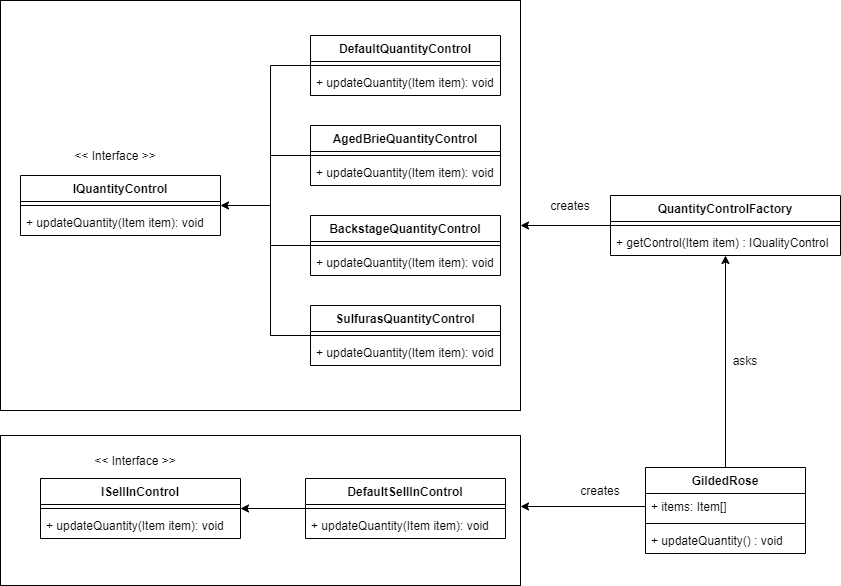

# Introduction
The Gilded Rose is my kata refactoring challenge. I am create the solution about this challenge using Java programming language.

# Requirement

Hi and welcome to team Gilded Rose. As you know, we are a small inn with a prime location in a
prominent city ran by a friendly innkeeper named Allison. We also buy and sell only the finest goods.
Unfortunately, our goods are constantly degrading in quality as they approach their sell by date. We
have a system in place that updates our inventory for us. It was developed by a no-nonsense type named
Leeroy, who has moved on to new adventures. Your task is to add the new feature to our system so that
we can begin selling a new category of items. First an introduction to our system:

	- All items have a SellIn value which denotes the number of days we have to sell the item
	- All items have a Quality value which denotes how valuable the item is
	- At the end of each day our system lowers both values for every item

Pretty simple, right? Well this is where it gets interesting:

	- Once the sell by date has passed, Quality degrades twice as fast
	- The Quality of an item is never negative
	- "Aged Brie" actually increases in Quality the older it gets
	- The Quality of an item is never more than 50
	- "Sulfuras", being a legendary item, never has to be sold or decreases in Quality
	- "Backstage passes", like aged brie, increases in Quality as its SellIn value approaches;
	Quality increases by 2 when there are 10 days or less and by 3 when there are 5 days or less but
	Quality drops to 0 after the concert

We have recently signed a supplier of conjured items. This requires an update to our system:

	- "Conjured" items degrade in Quality twice as fast as normal items

Feel free to make any changes to the UpdateQuality method and add any new code as long as everything
still works correctly. However, do not alter the Item class or Items property as those belong to the
goblin in the corner who will insta-rage and one-shot you as he doesn't believe in shared code
ownership (you can make the UpdateQuality method and Items property static if you like, we'll cover
for you).

Just for clarification, an item can never have its Quality increase above 50, however "Sulfuras" is a
legendary item and as such its Quality is 80 and it never alters.

# The Problem

```` 
class GildedRose {

    Item[] items;

    public GildedRose(Item[] items) {
        this.items = items;
    }

    public void updateQuality() {
        for (int i = 0; i < items.length; i++) {
            if (!items[i].name.equals("Aged Brie")
                    && !items[i].name.equals("Backstage passes to a TAFKAL80ETC concert")) {
                if (items[i].quality > 0) {
                    if (!items[i].name.equals("Sulfuras, Hand of Ragnaros")) {
                        items[i].quality = items[i].quality - 1;
                    }
                }
            } else {
                if (items[i].quality < 50) {
                    items[i].quality = items[i].quality + 1;

                    if (items[i].name.equals("Backstage passes to a TAFKAL80ETC concert")) {
                        if (items[i].sellIn < 11) {
                            if (items[i].quality < 50) {
                                items[i].quality = items[i].quality + 1;
                            }
                        }

                        if (items[i].sellIn < 6) {
                            if (items[i].quality < 50) {
                                items[i].quality = items[i].quality + 1;
                            }
                        }
                    }
                }
            }

            if (!items[i].name.equals("Sulfuras, Hand of Ragnaros")) {
                items[i].sellIn = items[i].sellIn - 1;
            }

            if (items[i].sellIn < 0) {
                if (!items[i].name.equals("Aged Brie")) {
                    if (!items[i].name.equals("Backstage passes to a TAFKAL80ETC concert")) {
                        if (items[i].quality > 0) {
                            if (!items[i].name.equals("Sulfuras, Hand of Ragnaros")) {
                                items[i].quality = items[i].quality - 1;
                            }
                        }
                    } else {
                        items[i].quality = items[i].quality - items[i].quality;
                    }
                } else {
                    if (items[i].quality < 50) {
                        items[i].quality = items[i].quality + 1;
                    }
                }
            }
        }
    }

}

````

````
class Item {

    public String name;

    public int sellIn;

    public int quality;

    public Item(String name, int sellIn, int quality) {
        this.name = name;
        this.sellIn = sellIn;
        this.quality = quality;
    }

    @Override
    public String toString() {
        return this.name + ", " + this.sellIn + ", " + this.quality;
    }

}
````

# UML Design


<div align='center'>



</div>


# How We Solve The Problem

First, we create a public getter and setter for the Item attributes and set the Item attributes access modifier from public into private.

````
class Item {
    
    ...
    
    public String getName() {
        return name;
    }

    public int getSellIn() {
        return sellIn;
    }

    public int getQuality() {
        return quality;
    }

    ...
    
}
````

Then we replace all the Item attributes on GildedRose class using public setter and getter

````
class GildedRose {
    ...
    
        public void updateQuality() {
            ...
            
                // if (!items[i].name.equals("Aged Brie") && !items[i].name.equals("Backstage passes to a TAFKAL80ETC concert")) {
                if (!items[i].getName().equals("Aged Brie") && !items[i].getName().equals("Backstage passes to a TAFKAL80ETC concert")) {

            ...   

                // items[i].quality = items[i].quality + 1;
                items[i].setQuantity(items[i].getQuantity() + 1);
            
            ...
        }
    
    ...
}
````

Next, we take a look the first if condition GildedRose's updateQuality function.

We got the code check if the item's name was not "Aged Brie" and also not "Backstage passes to a TAFKAL80ETC concert" 
and do some logic to update the quality of item.
Then we break the else code into a single if that do a task to check the item is "Aged Brie" or "Backstaged passes to a TAFKAL80ETC concert" and do their logic in it.

````
if (items[i].getName().equals("Aged Brie") || item[i].getName().equals("Backstaged passes to a TAFKAL80ETC concert")) {
    // do unrefactored update quality of age brie or backstage passes to a TAFKAL80ETC concert
}
````

after we break the else then we continue to the inner if that contained on if condition above.
we got the code that check if the item quality less than 50 then add +1 to the item quality. we can move this condition to the
Item class like this:

````
class Item {
    ...
    public boolean isQualityFull() {
        return quality >= 50;
    }
    ...
}
````
````
class GildedRose {
    ...
         if (! items[i].isQualityFull()) {
            // do unrefactored update quality logic
         }
    ...
}
````

then we go to the next line of code and found code that check if the item was "Backstage passes to a TAFKAL80ETC concert".
Then we put it out the inner if condition and add check "Backstage passes to TAFKAL80ETC" into it 
and we also remove the condition that check the item quality not full cause already checked before.
````
if (items[i].getName().equals("Backstage passes to a TAFKAL80ETC concert") && items[i].getSellIn() < 11) {
    item[i].increaseQuality();
}

if (items[i].getName().equals("Backstage passes to a TAFKAL80ETC concert") && items[i].sellIn < 6) {
    item[i].increaseQuality();
}
````
and also we change the operation of increase quality and move it to the Item class

````
class Item {
    ...
    public void increaseQuality() {
        quality++;
    }
    ...
}
````

That is it! we finally break the else code of first if, then we continue into the condition that 
check if item was not "Aged Brie" or "Backstage passes to a TAFKAL80ETC concert". we could merge this condition with the inner condition of it so will be like this:

````
if (!items[i].getName().equals("Aged Brie") && 
    !items[i].name.equals("Backstage passes to a TAFKAL80ETC concert") && 
    !items[i].name.equals("Sulfuras, Hand of Ragnaros") &&
    items[i].hasQuality()) {
        item[i].decreaseQuality();
}
````

and we create a function on Item class to check is the item has quality and also decrease quality function
````
class Item {
    ...
    public boolean hasQuality() {
        return this.quality > 0;
    }
    
    public void decreaseQuality() {
        quality--;
    }
    ...
}

````

and we put the check item name to like this:

````
class Item {
    ...
    public boolean isAgedBrie() {
        return name.equals("Aged Brie");
    }
    
    public boolean isBackstage() {
        return name.equals("Backstage passes to a TAFKAL80ETC concert");
    }
    
    public boolean isSulfuras() {
        return name.equals("Sulfuras, Hand of Ragnaros")
    }
    ...
}

````

also we separate all nested condition from the root condition then  the first if would be like this after we change a bit:

````
class GildedRose {
    
    ...
    
    public void updateQuantity() {
        if((item[i].isAgedBrie() || item[i].isBackstage()) && ! items[i].isQualityFull()) {
            item[i].increaseQuality();
        }
        
        if (items[i].isBackstaged() && item[i].getSellIn() < 11) {
            item[i].increaseQuality();
        }

        if (items[i].isBackstaged() && items[i].sellIn < 6) {
            item[i].increaseQuality();
        }
        
        if (!items[i].isAgedBrie() && !items[i].isBackstaged() && !items[i].isSulfuras() && item[i].hasQuality()) {
            item[i].decreaseQuality();
        }
        
        ...
    }

    ...

}
````

next we go to the next line of the code. we would to see handler to decrease the sellIn when the item was not "Sulfuras".
we would to add decrease sell in function into Item class

````
GildedRose {
    ...
        if (!items[i].isSulfuras()) {
            items[i].decreaseSellIn();
        }   
    ...
}
````

````
Item {
    ...
    public void decreaseSellIn() {
        sellIn--;
    }
    ...
}
````

then we jump to the next line code and separate all nested condition from root condition.

````
if(items[i].isAgedBrie() && items[i].getSellIn() < 0 && ! items[i].isQualityFull()) {
    items[i].increaseQuality();
}

if(items[i].isBackstaged() && item[i].sellIn < 0) {
    items[i].decreaseQuality();
}

if(! item[i].isAgedBrie() && ! item[i].isBackstaged() && ! items[i].isSulfuras() && && items[i].hasQuality() && items[i].getSellIn() < 0) {
    items[i].decreaseQuality();
}
````

the GildedRose class would be like this:

````
    if(items[i].isAgedBrie() && ! items[i].isQualityFull()) {
        items[i].increaseQuality();
    }

    if(items[i].isBackstage() && ! items[i].isQualityFull()) {
        items[i].increaseQuality();
    }
    
    if (items[i].isBackstaged() && item[i].getSellIn() < 11) {
        item[i].increaseQuality();
    }

    if (items[i].isBackstaged() && items[i].sellIn < 6) {
        item[i].increaseQuality();
    }
    
    if (! items[i].isAgedBrie() && ! items[i].isBackstaged() && ! items[i].isSulfuras() && item[i].hasQuality()) {
        item[i].decreaseQuality();
    }
    
    if (! items[i].isSulfuras()) {
        items[i].decreaseSellIn();
    }   
    
    if(items[i].isAgedBrie() && items[i].getSellIn() < 0 && ! items[i].isQualityFull()) {
        items[i].increaseQuality();
    }
    
    if(items[i].isBackstaged() && item[i].sellIn < 0) {
        items[i].decreaseQuality();
    }
    
    if(! item[i].isAgedBrie() && ! item[i].isBackstaged() && ! items[i].isSulfuras() && && items[i].hasQuality() && items[i].getSellIn() < 0) {
        items[i].decreaseQuality();
    } 
````

then break into a few function that relate into the item name:

````
if(items[i].isAgedBrie()) {
    updateQualityOfAgedBrie(items[i]);
} else if (items[i].isBackstaged()) {
    updateQualityOfBackstaged(items[i]);
} else if (items[i].isSulfuras()) {
    updateQualityOfSulfuras(items[i]);
} else {
    updateQualityUncheckedItem(items[i]);
}

public void updateQualityOfAgedBrie(Item item) {
    if(item.isQualityFull()) {
        item.increaseQuality();
    }
    
    item.decreaseSellIn();
    
    if(item.getSellIn() < 0 && ! items[i].isQualityFull()) {
        item.increaseQuality();
    }

}

public void updateQualityOfBackstaged(Item item) {
    if(! item.isQualityFull()) {
        item.increaseQuality();
    }
    
    if (item.getSellIn() < 11) {
        item.increaseQuality();
    }
    
    if (item.getSellIn() < 6) {
        item.increaseQuality();
    }
    
    item.decreaseSellIn();
    
    if(item[i].sellIn < 0) {
        items[i].decreaseQuality();
    }
}

public void updateQualityUncheckedItem(Item item) {
    if (item.hasQuality()) {
        item.decreaseQuality();
    }
    
    item.decreaseSellIn();
    
    if(item.hasQuality() && item.getSellIn() < 0) {
        item.decreaseQuality();
    } 
}
````

That is it! now we can extends the Item class to add updateQuality function with different implementation

````
class AgedBrieItem extends Item {
    public AgedBrieItem(String name, int sellIn, int quality) {
        super(name, sellIn, quality);
    }

    @Override
    public void updateQuantity() {
        if(isQualityFull()) {
            increaseQuality();
        }
        
        decreaseSellIn();
        
        if(getSellIn() < 0 && ! isQualityFull()) {
            increaseQuality();
        }
    }
}

class BackstagedItem extends Item {
     public BackstageItem(String name, int sellIn, int quality) {
        super(name, sellIn, quality);
    }

    @Override
    public void updateQuantity() {
        if(! isQualityFull()) {
            increaseQuality();
        }
        
        if (getSellIn() < 11) {
            increaseQuality();
        }
        
        if (getSellIn() < 6) {
            increaseQuality();
        }
        
        decreaseSellIn();
        
        if(sellIn < 0) {
            decreaseQuality();
        }
    }
}

class SulfurasItem extends Item {
    public SulfurasItem(String name, int sellIn, int quality) {
        super(name, sellIn, quality);
    }

    @Override
    public void updateQuantity() {
        // doing nothing
    }
}

class Item {
    ...
    
    public void updateQuality() {
        if (hasQuality()) {
            decreaseQuality();
        }
        
        decreaseSellIn();
        
        if(hasQuality() && getSellIn() < 0) {
            decreaseQuality();
        }
    }
    ...
}
````

finally! the kata refactoring challenge completed. 
